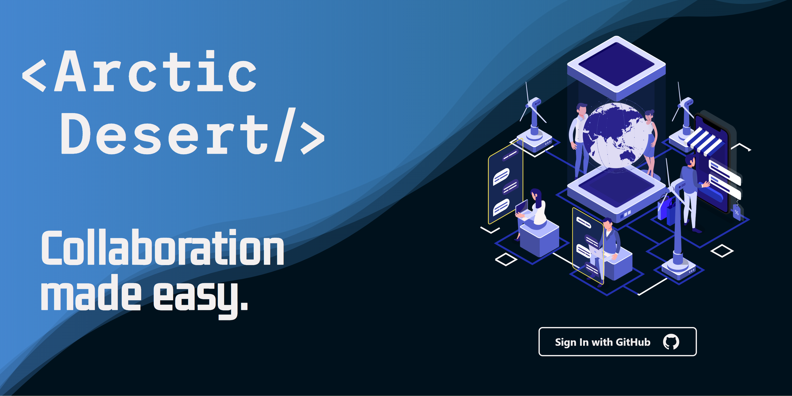
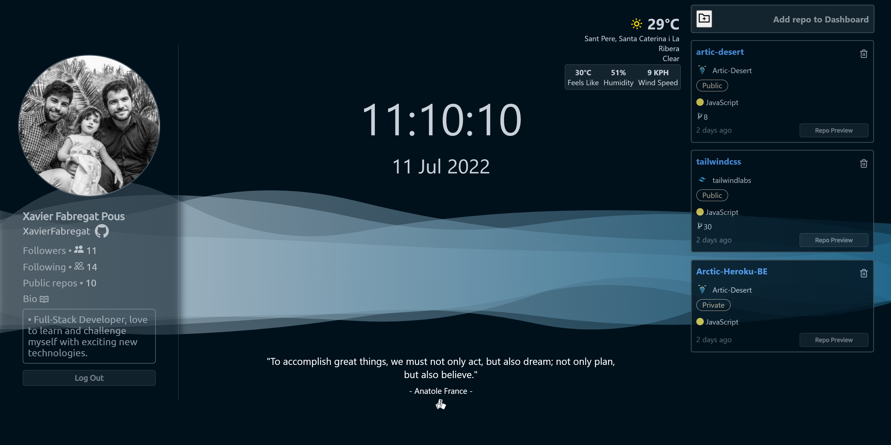
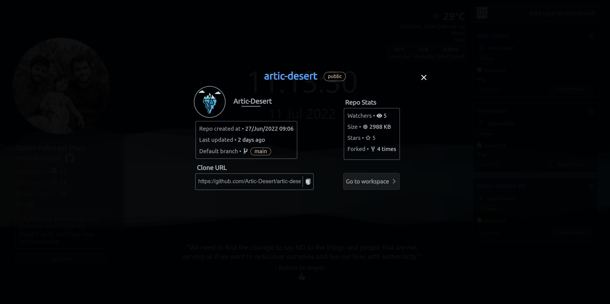
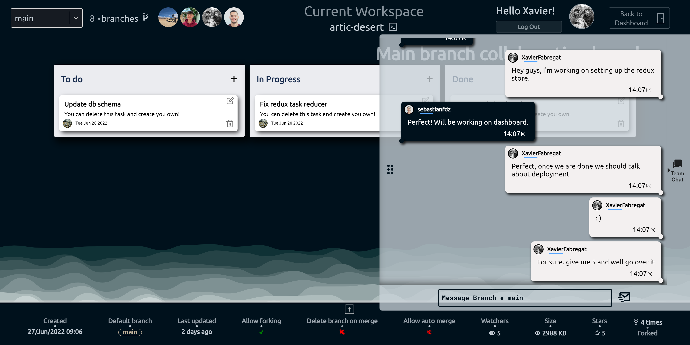
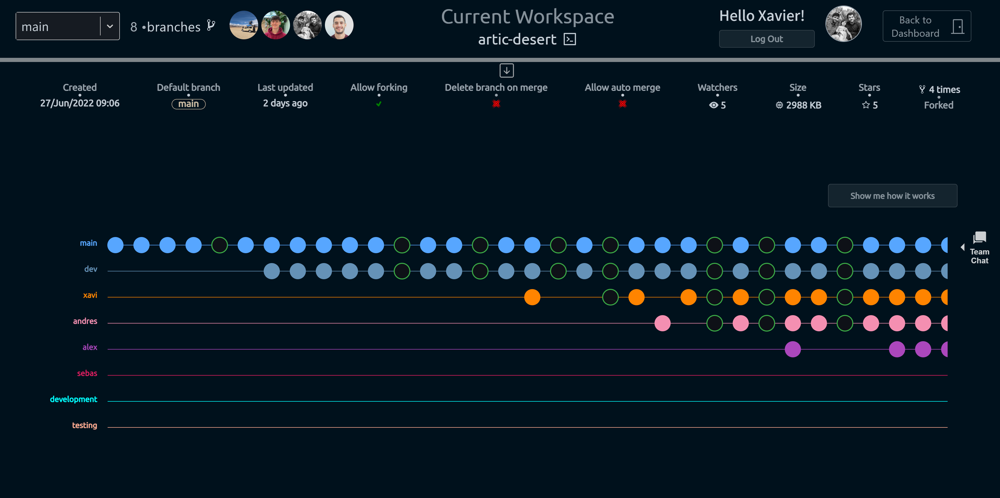
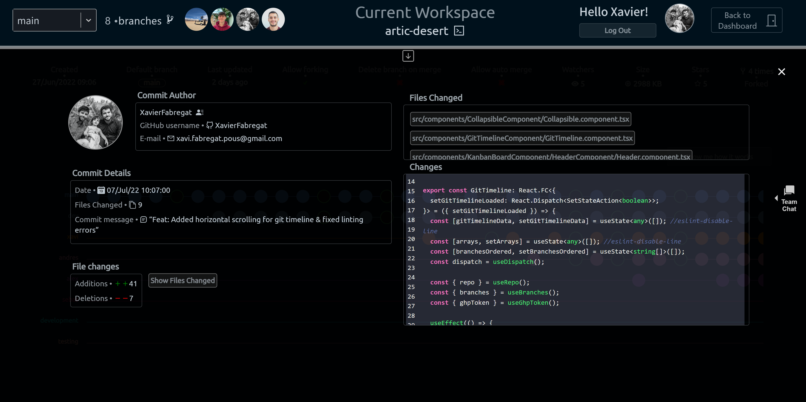

# Artic Desert

### By Alex Price-Richards, Andrés Rodriguez, Sebastian Fernandez and Xavier Fabregat

At Arctic Desert we set out to create an intuitive app that aids developer teams. We aimed to create a service that integrates git workflow, task management and real-time communication. This is integrated into a single workspace, allowing you to seamlessly switch between teams, projects and branches. Developers use multiple apps and interfaces during the development process and we were inspired to create an app that streamlines this workflow by boosting productivity and keeping an open line of communication.

## Tech Stack

### Frontend

<p>
	<a href="https://www.typescriptlang.org/" target="_blank" rel="noreferrer"
		></a>
<a href="https://reactjs.org/" target="_blank" rel="noreferrer"
		></a>
	<a href="https://redux.js.org/" target="_blank" rel="noreferrer"
		></a>
</p>

### Backend

<p>
  <a
		href="https://developer.mozilla.org/en-US/docs/Web/JavaScript"
		target="_blank"
		rel="noreferrer"
		></a>
   <a href="https://www.postgresql.org/" target="_blank" rel="noreferrer"
		></a>
  <a href="https://expressjs.com/" target="_blank" rel="noreferrer"
		></a>
   <a href="https://www.heroku.com/" target="_blank" rel="noreferrer"
		></a>
   <a href="https://aws.amazon.com/" target="_blank" rel="noreferrer"
		></a>
</p>

# Getting Started

To run this app on your own computer you'll need to clone this repository locally, to do so, you'll need git installed on your computer, you can check if it is by running <code>git --version</code>, once it is installed you'll need to run:

```
git clone https://github.com/Artic-Desert/artic-desert.git
```

Once you have cloned this repo, install the dependencies with the following command:

```
npm i --legacy-peer-deps
```

You'll need to create a .env file on the root directory with the following env variables:

```
REACT_APP_WEATHER_API_KEY={{YOUR_WEATHER_API_KEY_HERE}}
REACT_APP_GHP_TOKEN={{YOUR_GITHUB_GHP_TOKEN_HERE}}
```

The second one is only necessary to bypass the ghp token screen, if you don't create it, you'll need to input it through the UI.

- You can get your weather api key <a href='https://openweathermap.org/price' target='_blank'>here</a>.
- You can get your GitHub ghp token <a href='https://github.com/settings/tokens' target='_blank'>here</a>.

Once all this is set up, to run the app just type <code>npm start</code> in the console and the app will run on https://localhost:3000.

# Images

### Welcome Screen:



### Dashboard Screens:




### Workspace Screens:




